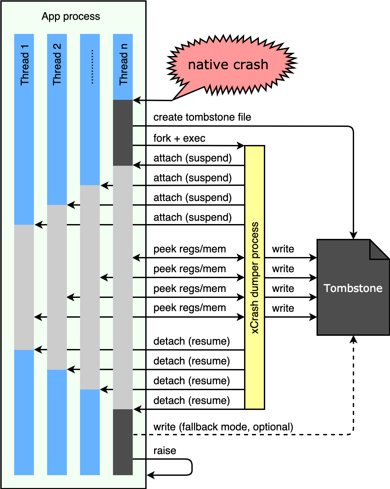

# xCrash


[](https://bintray.com/xcrash)


xCrash is a crash reporting library for Android APPs. It support catching native crash and Java exception.

xCrash can generate a tombstone file (similar format as Android system's tombstone file) in the directory you specified when the APP process crashes. And, no root permission or any system permissions are required.

xCrash is used in a variety of Android APPs (including iQIYI Video) from [iQIYI](http://www.iqiyi.com/) for many years.

[README 中文版](README.zh-CN.md)


## Features

* Support Android 4.0 - 9.0 (API level 14 - 28).
* Support armeabi, armeabi-v7a, arm64-v8a, x86 and x86_64.
* Catching native crash and Java exception.
* Setting which thread's info should be dumped via regular expressions.
* Dumping detailed memory usage statistics.
* Do not require root permission or any system permissions.


## Overview Maps

### Architecture

<p align="left"></p>

### Catching Native Crash

<p align="left"></p>


## Usage

#### 1. Adding dependency.

```Gradle
dependencies {
    implementation 'com.iqiyi.xcrash:xcrash-android-lib:2.0.13'
}
```

#### 2. Specifying ABI(s) you need.

```Gradle
android {
    defaultConfig {
        ndk {
            abiFilters 'armeabi', 'armeabi-v7a', 'arm64-v8a', 'x86', 'x86_64'
        }
    }
}
```

#### 3. Adding ProGuard rules.

```
-keep class xcrash.NativeCrashHandler {
    native <methods>;
    void callback(...);
}
```

#### 4. Initialize xCrash in `Application#attachBaseContext()`.

> Java

```Java
public class MyCustomApplication extends Application {

    @Override
    protected void attachBaseContext(Context base) {
        super.attachBaseContext(base);
        
        xcrash.XCrash.init(this);
    }
}
```

> Kotlin

```Kotlin
class MyCustomApplication : Application() {

    override fun attachBaseContext(base: Context) {
        super.attachBaseContext(base)

        xcrash.XCrash.init(this)
    }
}
```

Tombstone files will be written to `Context#getFilesDir() + "/tombstones"` directory by default. (usually in: `/data/data/<APP_PACKAGE_NAME>/files/tombstones`)

There is a more practical and complex sample APP in the [src/java/xcrash/xcrash_sample](src/java/xcrash/xcrash_sample) folder.


## Build

#### 1. Download [Android NDK r16b](https://developer.android.com/ndk/downloads/revision_history.html), set PATH environment. 

#### 2. Build and install the native libraries.

```
cd ./src/native/
./build.sh
./install.sh
```

#### 3. Build AAR library.

```
cd ./src/java/xcrash/
./gradlew :xcrash_lib:build
```


## Contributing

See [xCrash Contributing Guide](CONTRIBUTING.md).


## License

xCrash is MIT licensed, as found in the [LICENSE](LICENSE) file.

xCrash documentation is Creative Commons licensed, as found in the [LICENSE-docs](LICENSE-docs) file.
