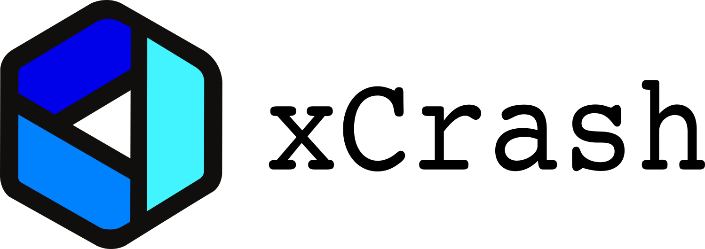
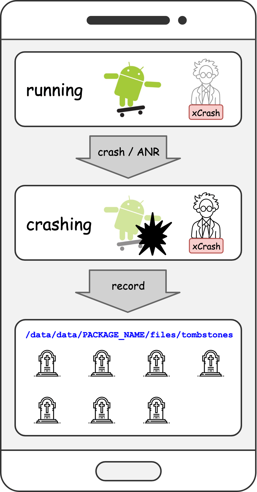
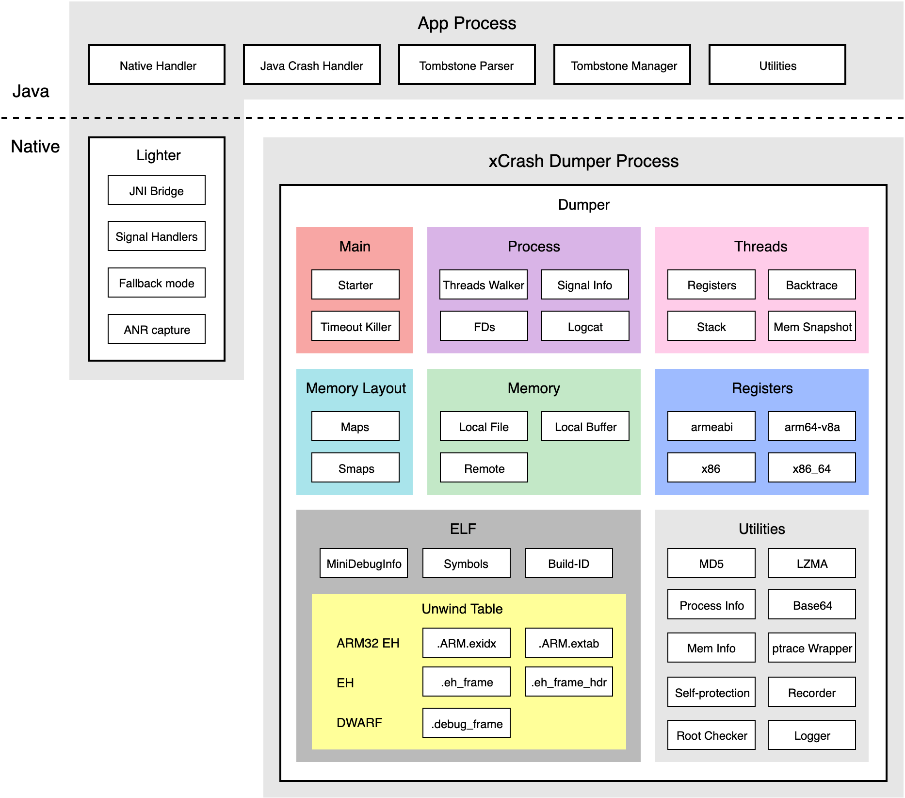
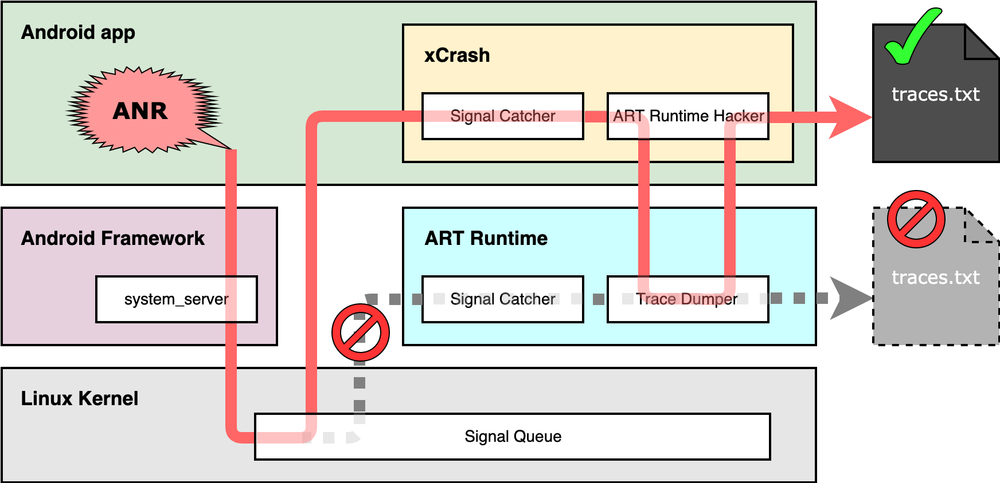

<p align="center"></p>

# xCrash


xCrash provides the Android app with the ability to capture java crash, native crash and ANR. No root permission or any system permissions are required.

<p align="left"></p>

xCrash can generate a tombstone file (similar format as Android system's tombstone file) in the directory you specified when the app process crashes or ANRs.

xCrash has been used in many Android apps (including iQIYI video) on different platforms (mobile, tablet, TV) of [iQIYI](http://www.iqiyi.com/) for many years.

[README 中文版](README.zh-CN.md)


## Features

* Support Android 4.1 - 11 (API level 16 - 30).
* Support armeabi-v7a, arm64-v8a, x86 and x86_64.
* Capturing java crash, native crash and ANR.
* Dumping detailed statistics about process, threads, memory, FD and network.
* Setting which thread's info should be dumped via regular expressions.
* Do not require root permission or any system permissions.


## Tombstone File Previews

* [java crash](doc/tombstone_java.txt)
* [native crash (armeabi-v7a)](doc/tombstone_native_armeabi-v7a.txt)
* [native crash (arm64-v8a)](doc/tombstone_native_arm64-v8a.txt)
* [native crash (x86)](doc/tombstone_native_x86.txt)
* [native crash (x86_64)](doc/tombstone_native_x86_64.txt)
* [ANR (armeabi-v7a)](doc/tombstone_anr_armeabi-v7a.txt)
* [ANR (arm64-v8a)](doc/tombstone_anr_arm64-v8a.txt)
* [ANR (x86)](doc/tombstone_anr_x86.txt)
* [ANR (x86_64)](doc/tombstone_anr_x86_64.txt)


## Overview Maps

### Architecture

<p align="left"></p>

### Capture Native Crash

<p align="left"></p>

### Capture ANR

<p align="left"></p>

## Usage

#### 1. Add dependency.

```Gradle
dependencies {
    implementation 'com.iqiyi.xcrash:xcrash-android-lib:3.0.0'
}
```

#### 2. Specify one or more ABI(s) you need.

```Gradle
android {
    defaultConfig {
        ndk {
            abiFilters 'armeabi-v7a', 'arm64-v8a', 'x86', 'x86_64'
        }
    }
}
```

#### 3. Initialize xCrash.

> Java

```Java
public class MyCustomApplication extends Application {

    @Override
    protected void attachBaseContext(Context base) {
        super.attachBaseContext(base);
        
        xcrash.XCrash.init(this);
    }
}
```

> Kotlin

```Kotlin
class MyCustomApplication : Application() {

    override fun attachBaseContext(base: Context) {
        super.attachBaseContext(base)

        xcrash.XCrash.init(this)
    }
}
```

Tombstone files will be written to `Context#getFilesDir() + "/tombstones"` directory by default. (usually in: `/data/data/PACKAGE_NAME/files/tombstones`)

There is a more practical and complex sample app in the [xcrash_sample](xcrash_sample) folder.


## Build

If you want to build xCrash from source code. Follow this guide:


#### Build AAR library.

```
./gradlew :xcrash_lib:build
```


## Support

* [GitHub Issues](https://github.com/iqiyi/xCrash/issues)
* [GitHub Discussions](https://github.com/iqiyi/xCrash/discussions)
* [Telegram Public Group](https://t.me/android_native_geeks)
* Email: <a href="mailto:caikelun@gmail.com">caikelun@gmail.com</a>, <a href="mailto:xuqnqn@qq.com">xuqnqn@qq.com</a>


## Contributing

See [xCrash Contributing Guide](CONTRIBUTING.md).


## License

xCrash is MIT licensed, as found in the [LICENSE](LICENSE) file.

xCrash documentation is Creative Commons licensed, as found in the [LICENSE-docs](LICENSE-docs) file.
